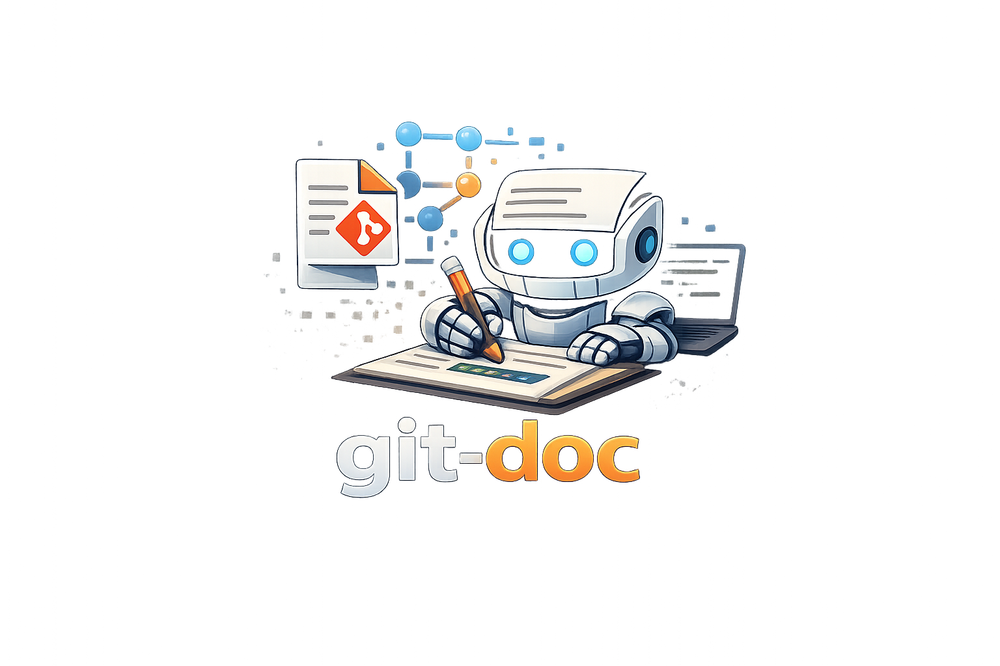

# git-doc

<p align="center">
   
</p>


Automatically update project documentation from Git commits using configurable LLM providers, deterministic state tracking, and safe Git automation.

## Why git-doc

- Reduces documentation drift by updating docs as code changes land.
- Supports multiple providers (`openai`, `anthropic`, `gemini`, `groq`, `ollama`, `mock`) with retries/failover.
- Keeps updates auditable with SQLite-backed run history and commit-to-doc mappings.
- Works both on-demand (`git-doc update`) and via Git hooks.

## Features

- Commit-range updates: `git-doc update --from <hash> --to <hash>`
- Resumable/retryable processing with state machine statuses
- Optional `amend_original` behavior for doc updates
- Atomic document writes and section-replacement logic
- Hook management (`enable-hook`, `disable-hook`)
- Status output in table or JSON form
- Revert support for linked documentation commits
- CI/CD with test, security, nightly, release, and packaging automation

## Installation

### Build from source

Prerequisites:

- Go 1.24+
- Git

```bash
git clone https://github.com/kowshik24/git-doc.git
cd git-doc
go build -o git-doc ./cmd/git-doc
```

### Install via `go install`

```bash
go install github.com/kowshik24/git-doc/cmd/git-doc@latest
```

## Quick start

1. Initialize project config/state:

   ```bash
   git-doc init
   ```

2. Edit configuration:

   ```bash
   git-doc config --edit
   ```

3. Process new commits:

   ```bash
   git-doc update
   ```

4. Check processing status:

   ```bash
   git-doc status
   ```

## Configuration

Default config path: `.git-doc/config.toml`

Key settings:

- `llm.provider`, `llm.api_key`, `llm.model`
- `llm.max_retries`, `llm.failover_enabled`, `llm.fallback_providers`
- `doc_files` and optional `mappings`
- `git.commit_doc_updates`, `git.amend_original`, `git.doc_commit_message`
- `state.db_path`

Print resolved config path:

```bash
git-doc config --path
```

## CLI reference

- `git-doc init` — initialize `.git-doc` directory and default config
- `git-doc config [--edit|--path]` — view/edit config
- `git-doc update [--dry-run] [--from <hash>] [--to <hash>]` — process commits
- `git-doc retry [--commit <hash>]` — retry failed/in-progress commits
- `git-doc status [--json] [--limit N]` — view processing history
- `git-doc revert <code-commit-hash>` — revert mapped doc commit
- `git-doc enable-hook` / `git-doc disable-hook` — manage Git hooks
- `git-doc version` — print CLI version

## CI/CD and release

This repository includes:

- `ci`: formatting, vet, tests, packaging smoke checks
- `security`: dependency review, `govulncheck`, `gosec`
- `nightly`: race and non-cached smoke runs
- `release`: GoReleaser, checksums signing, provenance attestation, packaging publish

Packaging automation details are documented in [`packaging/README.md`](packaging/README.md).

## Project structure

- `cmd/git-doc` — CLI entrypoint
- `internal/cli` — command wiring and app bootstrap
- `internal/orchestrator` — commit processing pipeline
- `internal/llm` — provider implementations and resilient client
- `internal/state` — SQLite state store and run metadata
- `internal/gitutil` — Git operations abstraction
- `internal/doc` — markdown updates and atomic file writes
- `.github/workflows` — CI/CD workflows

## Development

Run all tests:

```bash
go test ./...
```

Format code:

```bash
gofmt -w ./...
```

## License

MIT
